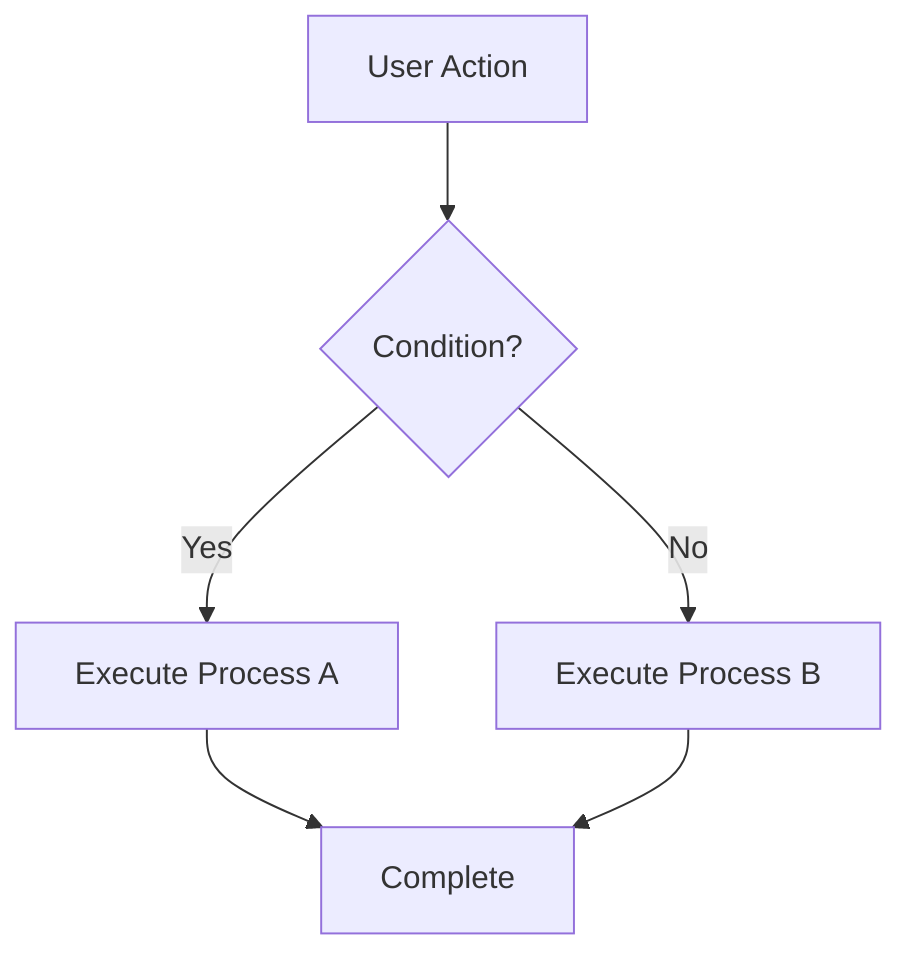

# Process Flows

## Purpose
This directory contains business process flows and technical architecture diagrams.

## Diagram Types

### Business Process Flows
- User journey maps
- Business logic flows
- Approval processes
- Integration flows

### Technical Architecture
- Apex class interaction diagrams
- Trigger execution order
- Batch/Queueable job flows
- API call sequences
- Event-driven architecture (Platform Events)

## Tools
- LucidChart
- Mermaid.js (for version-controlled diagrams)
- Draw.io
- Salesforce Flow Builder (for screen captures)

## File Naming Convention
- `ProcessName_Flow_Diagram.png`
- `ProcessName_Flow_Diagram.mmd` (Mermaid source)

---

## Mermaid.js Template
For version-controlled diagrams, use Mermaid syntax:

## Synchronous vs. Asynchronous Decision Matrix

| Criteria | Synchronous | Asynchronous |
|----------|-------------|--------------|
| **Response Time** | Immediate feedback required | Can be delayed |
| **Processing Time** | < 5 seconds | > 5 seconds |
| **Governor Limits** | Within standard limits | Heavy DML, SOQL, or CPU |
| **User Experience** | Interactive UI actions | Background processing |
| **Examples** | Validation rules, quick calculations | Batch jobs, callouts, complex processing |

## Implementation Approach

### Synchronous Solutions
- Apex Triggers (before/after)
- Lightning Web Components
- Flows (Screen Flows, Autolaunched Flows for simple logic)
- Validation Rules
- Process Builder (legacy)

### Asynchronous Solutions
- **Queueable Apex:** Chained jobs, callouts with processing
- **Batch Apex:** Processing large data volumes (> 50,000 records)
- **Future Methods:** Simple callouts
- **Scheduled Apex:** Recurring jobs
- **Platform Events:** Event-driven architecture

---
*This document follows The Colt Protocol - Stage 3: Business Process Mapping*
